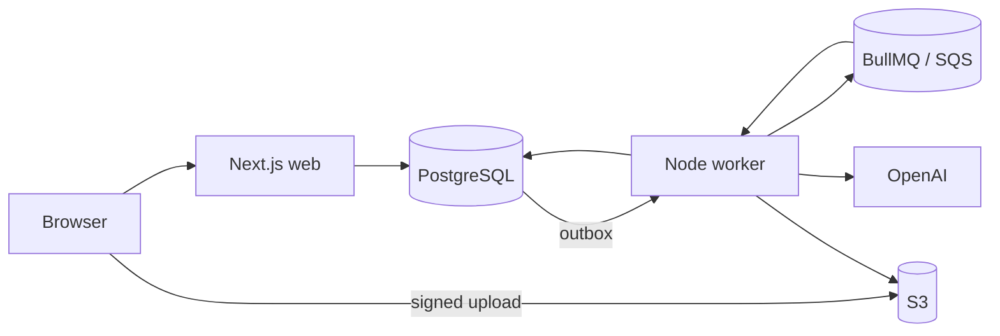

# VinylHound

[](https://github.com/jessig1/vinylhound_new/actions/workflows/ci.yml)
[](https://github.com/jessig1/vinylhound_new/actions/workflows/security.yml)
[](LICENSE)

> **Project status:** Phase 1 MVP complete. Phase 2 adds a public contribution
> workflow and just-in-time AWS deployment. The demonstration environment may
> be offline outside scheduled portfolio demos.

VinylHound is a mobile-first application for identifying vinyl albums from cover photos and organizing the results into a collection or wishlist. It supports camera capture, single-photo upload, and batch ingestion.

This repository contains the completed project foundation and a working first
vertical slice: the mobile web flow captures or selects a cover, uploads it with
progress, survives analysis through a refresh-safe status page, presents ranked
candidates for correction, and atomically adds the reviewed release to collection
or wishlist. PostgreSQL persistence, signed S3-compatible uploads, server-side
validation, transactional queue delivery, OpenAI analysis, and the complete audit
trail sit behind the web and worker boundaries.

VinylHound is a portfolio and learning project, not a verified catalog service.
AI and catalog results remain reviewable candidates, cover recognition does not
prove a particular pressing, and no uptime or support SLA is offered.

## Product shape

1. A user captures or uploads one or more photos for an album.
2. The app stores the originals and creates an asynchronous scan.
3. A worker asks the OpenAI Responses API for structured album candidates.
4. Domain policy marks the result identified, review-required, or unresolved.
5. The user confirms/corrects the result and adds it to their collection or wishlist.

Album-cover recognition and pressing identification are deliberately separate. A front cover can often identify an artist and title; a particular edition may require the back cover, spine, label, barcode, catalog number, runout data, or a catalog lookup.

## Repository map

```text
apps/
  web/          Mobile-first Next.js app and future HTTP API
  worker/       Retryable image-analysis and batch processing
packages/
  ai/           AI provider port and OpenAI adapter
  catalog/      Catalog provider port and MusicBrainz adapter
  config/       Server environment validation
  contracts/    Runtime-validated API, job, and AI schemas
  database/     Persistence boundary and future migrations
  domain/       Business rules with no infrastructure dependencies
  queue/        Background-job contracts
  storage/      Object-storage port
docs/
  decisions/    Architecture decision records
infra/
  terraform/    AWS platform and environment definitions
```

## Architecture

The application is a modular monolith with independently deployable web and
worker processes. PostgreSQL is authoritative, BullMQ/Redis transports local
jobs, SQS transports AWS jobs, and S3-compatible storage holds images. The
worker calls OpenAI only after the web process commits the scan and
transactional outbox record.



See [docs/ARCHITECTURE.md](docs/ARCHITECTURE.md) for boundaries, reliability
rules, authentication, and the AWS deployment evolution.

## Quick start

Requirements: Node.js 22 or newer, npm 10 or newer, Docker, and Docker Compose.

```bash
npm install
copy .env.example .env
docker compose up -d
npm run db:migrate
npm run dev
```

On macOS or Linux, use `cp .env.example .env`. Open `http://localhost:3000`.

The web shell does not require an OpenAI key. Before wiring or running image analysis, create an OpenAI API project/key and set `OPENAI_API_KEY` only in the server/worker environment. The consumer ChatGPT product is not called directly; VinylHound uses the OpenAI API.

Run `npm run dev:worker` in a second terminal to publish committed outbox rows to
Redis. When `OPENAI_API_KEY` is non-empty, the same process starts the BullMQ
analysis consumer. Without a key, publication still runs and analysis jobs
remain waiting without making billable API calls. AWS deployments select the
SQS adapter instead; local setup remains unchanged.

Album identification defaults to `gpt-5.6-sol` with `high` image detail and an
artist/title-first prompt. To validate it locally, upload the same difficult
cover three times, then upload 5-10 albums whose artist and title you know. Judge
the primary artist/title result separately from optional pressing metadata. If
the first pass is still unreliable, the next experiment is an `auto`-detail
retry on uncertain scans; catalog or web verification comes only after that.

Run the repository checks with:

```bash
npm run check
npm run build
```

## Contributing and support

VinylHound uses an issue-first contribution model. Small fixes and
documentation improvements are welcome; discuss substantial features or
architecture changes before implementation.

- Read [CONTRIBUTING.md](CONTRIBUTING.md) before opening a pull request.
- Use [GitHub Discussions](https://github.com/jessig1/vinylhound_new/discussions)
  for proposals, questions, and support.
- Use [GitHub Issues](https://github.com/jessig1/vinylhound_new/issues) for
  accepted work and reproducible bugs.
- Report vulnerabilities privately according to [SECURITY.md](SECURITY.md).
- Follow the [Code of Conduct](CODE_OF_CONDUCT.md).

## Documentation

- [Product definition](docs/PRODUCT.md)
- [Architecture](docs/ARCHITECTURE.md)
- [Domain model](docs/DOMAIN.md)
- [API and job contracts](docs/API.md)
- [OpenAI integration](docs/OPENAI_INTEGRATION.md)
- [Security and privacy](docs/SECURITY.md)
- [Operations runbook](docs/OPERATIONS.md)
- [Public repository operations](docs/PUBLIC_REPOSITORY.md)
- [Testing and AI evaluations](docs/TESTING.md)
- [Private model evaluation runner](docs/EVALUATION.md)
- [Catalog source evaluation](docs/CATALOG_EVALUATION.md)
- [Delivery roadmap](docs/ROADMAP.md)
- [Architecture decisions](docs/decisions/README.md)
- [Contributing guide](CONTRIBUTING.md)
- [Security reporting](SECURITY.md)

## Current boundaries

The repository is a modular monolith, not a collection of deployed microservices. The web app and worker are separate processes, while shared packages enforce boundaries. That is enough separation for independent scaling later without forcing distributed-system overhead into the personal-project phase.

## License

VinylHound is available under the [MIT License](LICENSE).
