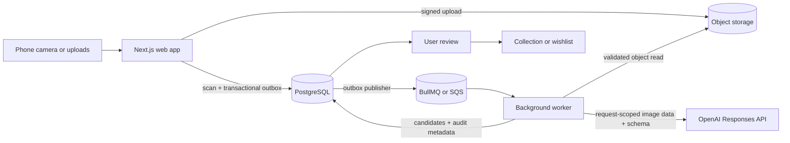
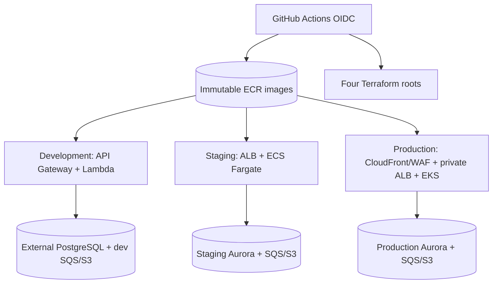

# Architecture

## Decision summary

VinylHound is a modular monolith with two processes: a Next.js web application
and a Node.js background worker. PostgreSQL is the source of truth, a durable
queue transports retryable jobs, and S3-compatible storage holds images.
BullMQ/Redis is the local queue adapter; AWS environments use SQS. Shared
TypeScript packages keep provider and domain boundaries explicit.

## Why asynchronous scans

Camera uploads and batch analysis are slower and less reliable than normal HTTP requests. The web request should finish after durable scan creation and job enqueueing. The worker can then retry transient provider failures, enforce concurrency/rate limits, and update item-level progress without tying work to a browser connection.

## Core flow

1. Web creates a scan in `awaiting_upload` and returns signed upload instructions.
2. Browser uploads directly to object storage and reports completed image metadata/checksums.
3. Web validates ownership/completeness, atomically marks the scan `queued`, and publishes an idempotent job.
4. Worker claims the job, marks it `processing`, reads the authoritative validated objects, creates request-scoped Base64 data URLs, and calls the AI adapter.
5. Structured output is validated. Domain policy independently determines whether the result can be presented as identified or needs review.
6. User confirmation creates or selects a canonical release and adds or converts
   a library item in one transaction. If the user owns it, the same transaction
   creates a physical-copy row. A user-triggered MusicBrainz search may attach
   namespaced release-group/release references and richer reviewed metadata;
   catalog output remains a candidate. The confirmation retains the selected AI
   candidate, reviewed corrections, catalog provenance, and originating scan.

Submission writes the `queued` scan state and a versioned outbox message in one
PostgreSQL transaction. The worker publishes pending messages through the queue
port using a deterministic idempotency key and only then marks them published.
A crash between those steps causes a safe duplicate publication attempt instead
of a lost scan. BullMQ uses that key as its job ID; SQS FIFO uses it as the
deduplication ID and the scan ID as the message group.

## Boundaries

- Browser: capture, preview, client-side UX checks, direct upload, progress. No secrets and no authoritative validation.
- Web/API: authentication, authorization, signed URLs, commands, queries, idempotency, and orchestration.
- Worker: retries, provider calls, concurrency controls, scan attempts, and terminal failure handling.
- Domain: review policy, legal status transitions, duplicate rules, and library invariants.
- Providers: OpenAI, MusicBrainz catalog, queue, and storage behind interfaces.

## Discovery service (P4.1, ADR-0025)

Development keeps the MusicBrainz/Spotify provider adapters in process behind
`CatalogProvider`/`DiscoveryProvider` (`packages/catalog`), exactly as
described above. Staging and production instead run a third, standalone
process — `apps/discovery` — that owns those same adapters behind an
authenticated internal HTTP API; `apps/web` calls it through a remote client
implementing the identical port interfaces
(`createRemoteCatalogClient`/`createRemoteDiscoveryClient`), selected by
whether `DISCOVERY_SERVICE_URL` is configured. Every internal request carries
a short-lived signed token (`@vinylhound/service-auth`) binding the caller's
authenticated user ID to a shared secret only `apps/web` holds, rather than a
bare header. `apps/discovery` is stateless and owns no canonical rows:
`albums`, `releases`, and `catalog_references` stay with core/library, so
`confirmScan` keeps one transaction across catalog and library writes. See
ADR-0025 for why this is the first extraction and ADR-0009 for the shared
cache/rate-limit requirement that motivated it.

Per ADR-0026, `apps/discovery` runs as exactly one instance per environment
with a stop-then-start rollout, not the multi-replica pattern web/worker use:
a staging ECS service (`deployment_minimum_healthy_percent = 0`, no
autoscaling target, reached from web over ECS Service Connect at the
in-cluster name `discovery`) and a production Kubernetes `Deployment`
(`strategy: { type: Recreate }`, `replicas: 1`, no HPA, no
`PodDisruptionBudget`, reached over a plain `ClusterIP` Service) — both added
in P4.1 Task 5 alongside its own ECR repository and IAM/Pod execution role.
Development is unaffected: it keeps the in-process adapter under ADR-0025's
tier scope.

## Scan and core services (P4.2, ADR-0027 through ADR-0030)

Roadmap P4.2 extracted a second boundary: `scan` (scans, batches, images,
attempts, reviewed confirmations, and the outbox) and `core` (users,
catalog, library, copies, favorites, playlists, and confirmation receipts).
**Task 7 (ADR-0030) completed the physical cutover**: two Postgres schemas
and two least-privilege roles (`vinylhound_scan_app`/`vinylhound_core_app`)
in one physical PostgreSQL deployment, no cross-schema `GRANT` in either
direction, replacing the single undivided schema and single `DATABASE_URL`
every prior P4.2 task worked ahead of. Every repository function now takes
a role-scoped, compiler-checked `ScanDatabase` or `CoreDatabase` handle
(`packages/database/src/database.ts`) instead of one opaque connection;
`apps/web`'s and `apps/worker`'s entry points construct both at startup and
route each call, handler, and background sweep to the one matching the
table(s) it touches. The eight cross-schema foreign keys ADR-0027 named are
gone (migration 022, the "writer switch"): three `→ users` cascades became
plain UUID attributes (an authenticated-request-path invariant, as
ADR-0027 predicted), `confirmed_from_scan_id` became a fixed audit
reference, and the three remaining `scan_confirmations` FKs into `core`
became soft references backed by application-level liveness checks and
best-effort projections. **A Postgres nuance worth stating plainly**: a
cross-schema FK's referential-integrity check runs with the referenced
table's owner rights, not the connecting role's, so those eight FKs kept
silently working through the schema/role split itself (migration 021,
additive and behavior-neutral by design) — the GRANT boundary alone never
removed them; migration 022 dropping them on purpose is what actually did.
See ADR-0030 for the full design, including the account-deletion
two-phase workflow, the ADR-0018 liveness/self-heal replacement for the
FKs that used to null a stale reference automatically, and the denormalized
`library_items.confirmed_release` that replaced library reads' only
cross-schema SQL join (search/sort/pagination, ADR-0023, cannot span two
connections).

**Task 6 (ADR-0029) made account deletion a durable, drain-then-delete
workflow**, closing the coupling `deleteAccount`'s single cross-schema
transaction (ADR-0014) represented. `DELETE /api/v1/account` still
hard-deletes immediately when the account has no `pending` `scan_confirmations`
(the common case, unchanged from before); otherwise it durably records the
request (`users.deletionRequestedAt`) and defers the hard delete to a
background sweep that finalizes once every pending confirmation drains.
`confirmScan` refuses to start a new confirmation once deletion has been
requested. This closes the race ADR-0028 documented and left open: a
`scan.confirmed.v1` event already dispatched before a delete request can
still be processed by `processScanConfirmation` against a `users` row that
is guaranteed to still exist, instead of racing account deletion into a
foreign-key violation.

**Task 3 (ADR-0028) replaced `confirmScan`'s single cross-boundary
transaction with a three-hop async pipeline**, all still running inside
today's one `apps/worker` process:

1. `confirmScan` (scan-owned) records a `pending` `scan_confirmations` row
   and enqueues a `scan.confirmed.v1` event via the generalized
   `outbox_messages` table (Task 2).
2. `processScanConfirmation` (core-owned) consumes that event, resolves the
   release, writes `library_items`/`library_copies`, and atomically records a
   `confirmation_receipts` row — an inbox dedupe guard and the
   `confirmation.completed.v1` event to dispatch, in one row.
3. `applyConfirmationCompletion` (scan-owned) consumes that event and
   projects the result onto `scan_confirmations`, flipping its `status` to
   `completed`.

The scan page's existing queued/processing poll loop now also polls while a
confirmation is `pending`, so the UI never reports a completed save before
the projection lands. See ADR-0028 for the full design (Task 4: replay/
conflict polish and UI; Task 5: isolated dispatch and a latency target; Task
6, ADR-0029: the FK policy and account-deletion rework; Task 7, ADR-0030,
above: the physical schema/role/connection cutover that completes P4.2).

**Task 5 isolated hop 1 -> 2 dispatch from scan-analysis dispatch and set a
latency target.** `dispatchNextOutboxMessage` now scopes its claim to the
topics registered with it, so `apps/worker` runs `scan.analyze.v1` and
`scan.confirmed.v1` as two independent dispatch loops against
`outbox_messages` rather than one shared FIFO claim -- a deep analysis
backlog can no longer delay a newer confirmation event. Both confirmation
hops (`scan.confirmed.v1` dispatch and the existing `confirmation_receipts`
dispatch) run on a new, faster `CONFIRMATION_DISPATCH_POLL_INTERVAL_MS`
(200ms default), independent of the analysis-only `OUTBOX_POLL_INTERVAL_MS`.
The confirmation-to-library latency target (p95 ≤ 2000ms,
`scan_confirmations.confirmedAt` to `confirmation.completed.v1`'s
`completedAt`) is directly measured, not just estimated:
`applyConfirmationCompletion` returns the latency and the worker logs it as
`confirmationToLibraryLatencyMs`. See ADR-0028's 2026-09-21 amendment.

## Platform delivery repository (P4.3 Task 1, ADR-0031)

A decision record only — nothing described here has been created yet.
ADR-0031 documents the target split for a future, dedicated platform
repository: the four `infra/terraform/` roots (`bootstrap`, `development`,
`environment`, `production`), `infra/kubernetes/**`, and every workflow step
that applies Terraform or deploys would move there; Dockerfiles, application
source, `ci.yml`/`security.yml`, and each service image's build-and-push
step stay in this repository, so the platform repository never needs
application build context and only ever consumes an already-built, already-
scanned image by immutable digest — the same `staging-passed-<sha>`
promotion contract staging and production already use today, preserved
unchanged. OIDC roles would narrow along a second axis (per-repository
build role, plus per-environment deploy roles scoped to the AWS services
each Terraform root actually manages, replacing today's one broad policy
shared across all three environments). See ADR-0031 for the full inventory
and rationale; P4.3 Tasks 2-4 perform the actual inventory, rehearsed
transfer, and staging demonstration.

## Deployment evolution

For personal use, web and worker can run on one host with one PostgreSQL/Redis deployment. Scale in this order only when measurements justify it:

1. Move images to managed object storage and database backups to managed PostgreSQL.
2. Scale workers horizontally with global provider concurrency limits.
3. Add read replicas/caching for large collection queries.
4. Split a service only when it needs independent ownership, deployment, or scaling; package boundaries are the extraction seams.

## Reliability and observability

- Every scan, upload, job, provider attempt, and user command gets a stable ID.
- Use structured logs with IDs and durations, never image bytes or secrets.
- Record model, prompt version, image count, status, latency, token usage, and normalized error category.
- Retry timeouts, rate limits, and provider 5xx responses with exponential backoff and jitter. Do not retry invalid inputs or schema failures indefinitely.
- Jobs must be idempotent and safe to redeliver. Terminal failures remain visible and manually retryable.
- `GET /api/healthz` is a process liveness probe and `GET /api/readyz`
  verifies PostgreSQL readiness without exposing dependency details. The
  operational alerting, backup, and restore procedure is in
  `docs/OPERATIONS.md`.
- Before a scan job enters the outbox, a per-user transactional quota check
  enforces daily analysis volume, active scans, and rolling spend. Active jobs
  reserve a configured cost while their actual token usage is unknown, so
  concurrent submissions cannot evade a monthly budget.

## Authentication

All persisted user-owned rows and object keys include a user identifier
(`users.id`, an internal UUID unrelated to any external identity provider),
established in the first vertical slice. `AUTH_MODE` selects how that ID is
resolved per request (ADR-0013):

- `development` (default): every request uses a single fixed
  `DEVELOPMENT_USER_ID`. No external identity provider is involved; local
  dev, CI, and integration tests run this way with no auth-provider keys.
- `production`: Clerk issues and verifies the session; `apps/web/src/proxy.ts`
  (Next.js's Proxy/Middleware convention) protects routes, and
  `requireUserId` (`apps/web/src/server/auth.ts`) resolves the verified
  Clerk identity to a local `users.id`, provisioning a row just-in-time on
  first request via `users.clerk_user_id`.

Introducing `production` mode changed identity issuance and session
verification only, not the data model — every foreign key still points at
`users.id` exactly as before.

## Phase 2 AWS deployment

ADR-0016 preserves the web/worker boundary while deliberately exercising three
runtime shapes. GitHub Actions uses environment-scoped OIDC roles and immutable
ECR digests. Staging verifies the same web and long-running worker images that
production promotes; development uses the web image plus a Lambda-specific
worker entrypoint.

Development has no VPC or idle worker: API Gateway and SQS invoke Lambdas, and
EventBridge periodically publishes committed outbox rows. Staging web and
worker tasks run in private subnets on Fargate. Production pods run on two ARM64
managed EKS nodes with separate Pod Identity roles; CloudFront reaches the
internal ALB through a VPC origin. Staging and production create a single NAT
only while active for Clerk, MusicBrainz, and OpenAI egress, while an S3 gateway
endpoint keeps object traffic private.

The environment differences, persistent/active resource split, scaling limits,
and deactivation gate are defined in ADR-0016 and `docs/OPERATIONS.md`.
