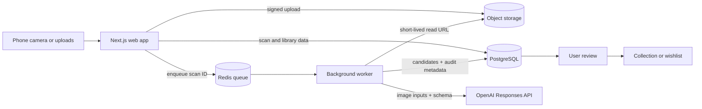

# Architecture

## Decision summary

VinylHound starts as a modular monolith with two processes: a Next.js web application and a Node.js background worker. PostgreSQL is the source of truth, Redis backs retryable jobs, and S3-compatible storage holds images. Shared TypeScript packages keep provider and domain boundaries explicit.

## Why asynchronous scans

Camera uploads and batch analysis are slower and less reliable than normal HTTP requests. The web request should finish after durable scan creation and job enqueueing. The worker can then retry transient provider failures, enforce concurrency/rate limits, and update item-level progress without tying work to a browser connection.

## Core flow

1. Web creates a scan in `awaiting_upload` and returns signed upload instructions.
2. Browser uploads directly to object storage and reports completed image metadata/checksums.
3. Web validates ownership/completeness, atomically marks the scan `queued`, and publishes an idempotent job.
4. Worker claims the job, marks it `processing`, creates short-lived image URLs, and calls the AI adapter.
5. Structured output is validated. Domain policy independently determines whether the result can be presented as identified or needs review.
6. User confirmation creates or selects a canonical release and adds a library item in one transaction.

Use a transactional outbox or equivalent atomic enqueue pattern when persistence is implemented; a database commit must not leave a scan permanently unqueued.

## Boundaries

- Browser: capture, preview, client-side UX checks, direct upload, progress. No secrets and no authoritative validation.
- Web/API: authentication, authorization, signed URLs, commands, queries, idempotency, and orchestration.
- Worker: retries, provider calls, concurrency controls, scan attempts, and terminal failure handling.
- Domain: review policy, legal status transitions, duplicate rules, and library invariants.
- Providers: OpenAI, queue, storage, and future catalog sources behind interfaces.

## Deployment evolution

For personal use, web and worker can run on one host with one PostgreSQL/Redis deployment. Scale in this order only when measurements justify it:

1. Move images to managed object storage and database backups to managed PostgreSQL.
2. Scale workers horizontally with global provider concurrency limits.
3. Add read replicas/caching for large collection queries.
4. Split a service only when it needs independent ownership, deployment, or scaling; package boundaries are the extraction seams.

## Reliability and observability

- Every scan, upload, job, provider attempt, and user command gets a stable ID.
- Use structured logs with IDs and durations, never image bytes or secrets.
- Record model, prompt version, image count, status, latency, token usage, and normalized error category.
- Retry timeouts, rate limits, and provider 5xx responses with exponential backoff and jitter. Do not retry invalid inputs or schema failures indefinitely.
- Jobs must be idempotent and safe to redeliver. Terminal failures remain visible and manually retryable.

## Authentication assumption

The first vertical slice may use a single development user, but all persisted user-owned rows and object keys should include a user identifier. Introducing multi-user authentication then changes identity issuance, not the data model.
