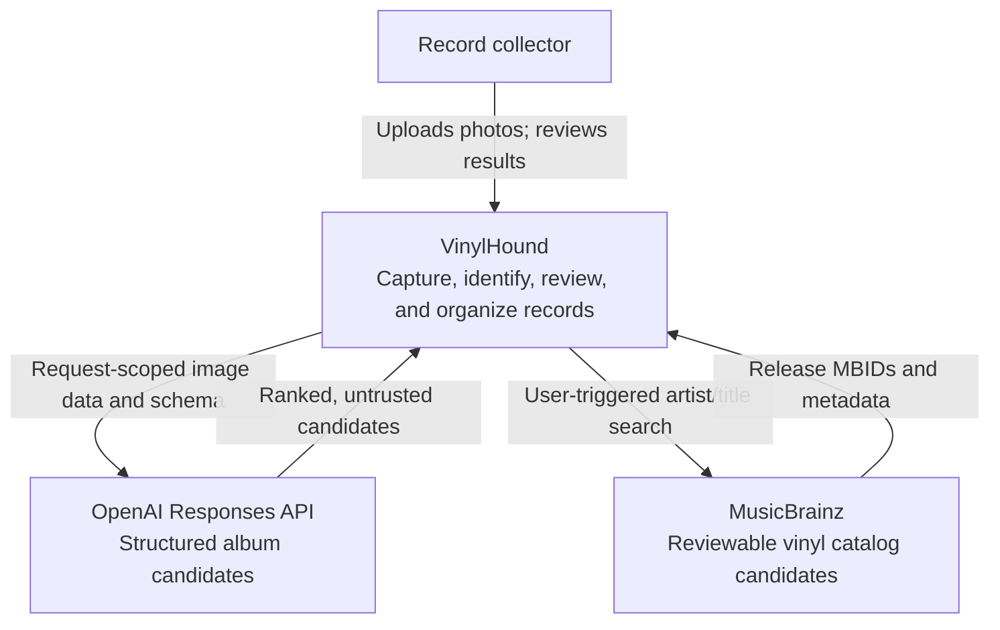
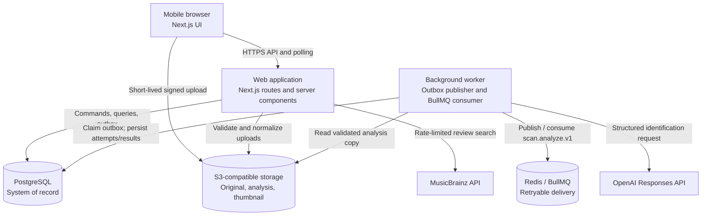
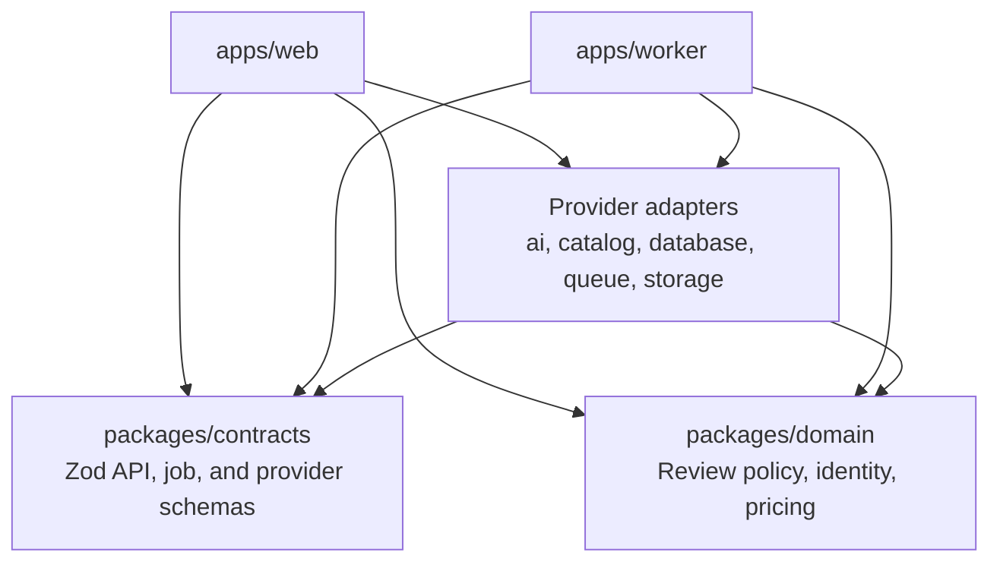
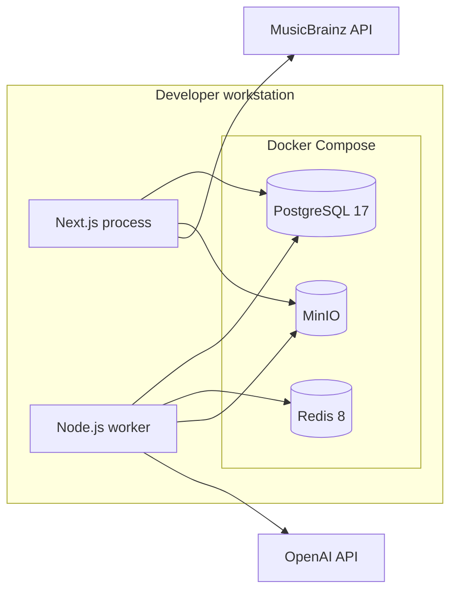

# Current system

**Status: Current**

VinylHound is a mobile-first TypeScript modular monolith. A Next.js process
owns browser UX and HTTP orchestration; a Node.js worker owns outbox publication
and retryable image analysis. PostgreSQL is authoritative, Redis carries
BullMQ jobs, and S3-compatible object storage holds user images and derived
copies.

## System context

The model produces candidates, not catalog truth. VinylHound's domain policy
routes results to identified, review-required, or unresolved states, and only a
user confirmation can create or update a library item.

## Container view

## Code boundaries

Dependencies point inward. The domain package does not depend on web
frameworks, storage, queues, or the database. Provider integrations are behind
ports, while runtime-validated contracts cross process and network boundaries.

## Local deployment

GitHub Actions runs formatting, linting, type checks, tests, and builds. There
is no production cloud deployment, production authentication, managed backup,
or centralized observability in the current implementation.

## Trust boundaries

| Boundary | Current control |
| --- | --- |
| Browser to web | The browser never receives provider keys or unrestricted storage credentials; the development identity is resolved server-side. |
| Browser to object storage | Object keys are generated server-side and uploads use short-lived, object-scoped signed instructions. |
| Upload to trusted image | Completion rereads the object, checks declared and decoded type, size, dimensions, and checksum, then derives bounded JPEG copies. |
| Database to queue | Scan state and an outbox message commit atomically; deterministic BullMQ job IDs make publication safe to retry. |
| Worker to AI provider | The worker reads authoritative objects, sends request-scoped Base64 data URLs, validates structured output, and persists audit metadata. |
| Web to catalog provider | MusicBrainz search is user-triggered, server-side, limited to one request per second, retried only for transient responses, cached for 24 hours, and persisted only after review. |
| Candidate to library | Domain review policy and explicit user confirmation prevent AI output from becoming catalog truth automatically. |

## Current quality attributes

- **Durability:** accepted scans survive browser refreshes and Redis outages
  because PostgreSQL owns scan and outbox state.
- **Idempotency:** mutating commands and deterministic job identities limit
  duplicate rows and duplicate provider spend.
- **Auditability:** model, prompt version, delivery attempt, token usage,
  duration, errors, candidates, and reviewed corrections are retained.
- **Catalog provenance:** selected MusicBrainz release-group/release MBIDs,
  source URL, and fetch time enrich internal UUID-based records without making
  the provider schema authoritative.
- **Cost control:** image normalization, worker concurrency, disabled analysis
  without a configured key, and usage summaries bound accidental provider use.
- **Evolvability:** web, worker, domain, contracts, and provider adapters have
  explicit package boundaries without distributed-system overhead.
