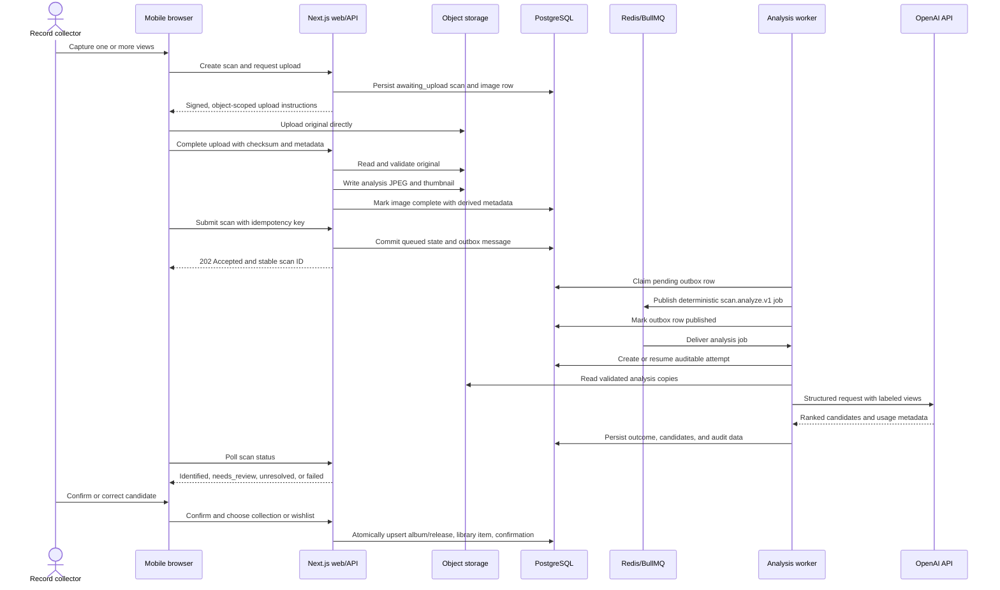
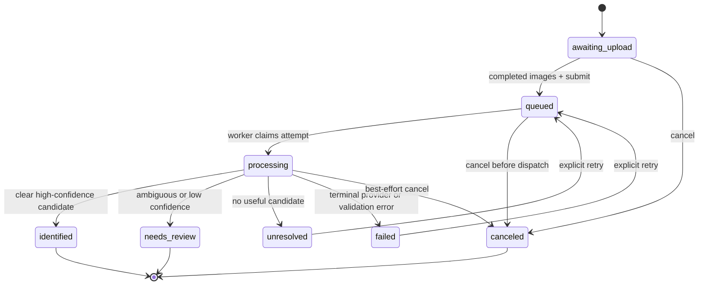

# Scan lifecycle

**Status: Current**

The scan pipeline separates a fast, durable HTTP transaction from slow and
billable image analysis. PostgreSQL is the source of truth throughout; Redis is
an at-least-once delivery mechanism rather than the authoritative job record.

## End-to-end sequence

The web response does not wait for the queue or provider. A crash after Redis
accepts a job but before the outbox row is marked published can cause another
publication attempt, but the deterministic job ID and attempt-state check avoid
a second paid analysis for the same live attempt.

## Scan state machine

Cancellation during an in-flight provider call does not abort that request. The
attempt may finish and persist its result, but cancellation prevents future
attempts. This is an accepted proportionality tradeoff documented in ADR-0006.

## Multi-view and batch semantics

| User action                                                                 | Domain representation                        | Analysis behavior                                                                   |
| --------------------------------------------------------------------------- | -------------------------------------------- | ----------------------------------------------------------------------------------- |
| Front, back, spine, label, barcode, or runout images of one physical record | One scan with several labeled image assets   | One provider request combines all evidence                                          |
| Photos of several different records                                         | One batch grouping several independent scans | Each scan has its own outbox message, job, attempt, result, retry, and cancellation |

A batch is a read-side grouping, not a job or transaction boundary. One failed
record does not fail the other scans in the batch.

## Retry ownership

| Failure                                                 | Owner            | Behavior                                                            |
| ------------------------------------------------------- | ---------------- | ------------------------------------------------------------------- |
| Redis unavailable during publication                    | Outbox publisher | Leave the PostgreSQL row pending and try again later                |
| Provider timeout, rate limit, or 5xx                    | BullMQ delivery  | Retry with bounded attempts and backoff; append delivery audit data |
| Invalid image, refusal, or schema failure               | Worker/domain    | Persist a visible terminal result; do not retry indefinitely        |
| User wants a new attempt after `failed` or `unresolved` | User command     | Create logical attempt N+1 and reuse completed images               |
| `needs_review` result                                   | User review      | Confirm or correct it; do not spend on an automatic retry           |

## Observability keys

Every scan, image, outbox message, queue job, logical attempt, delivery attempt,
provider response, candidate, and confirmation has a stable identifier. Logs
should contain identifiers, status, category, and duration—but never image bytes,
full signed URLs, provider secrets, or raw provider payloads.
