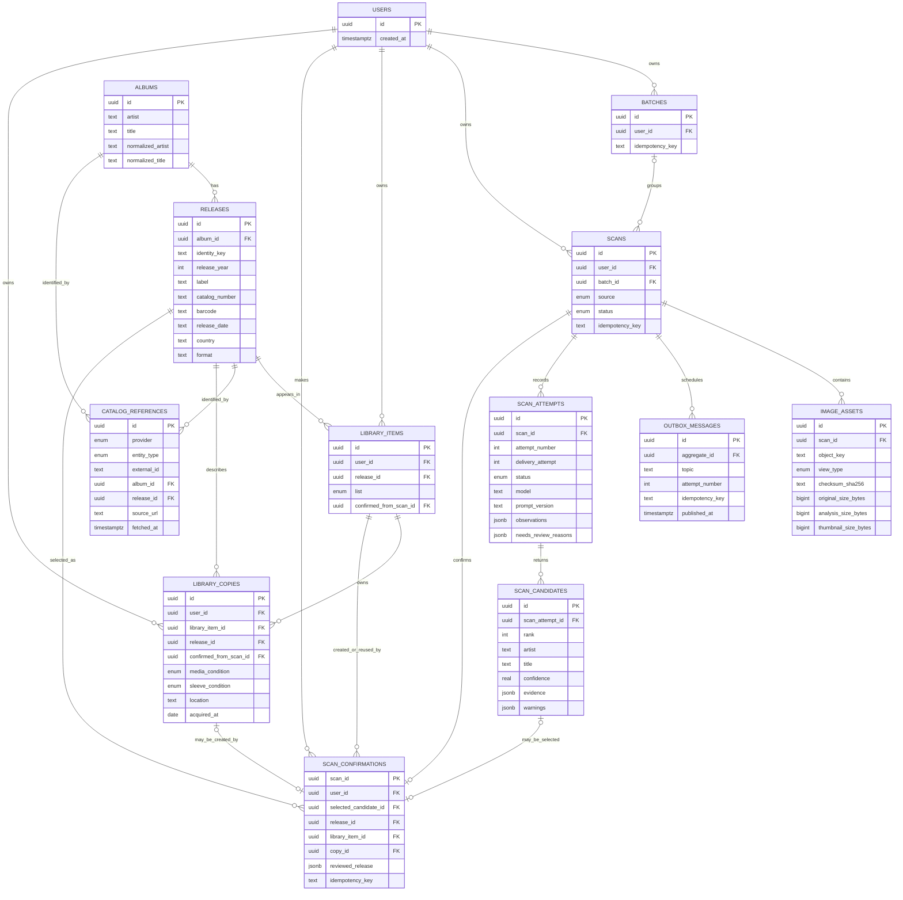

# Data architecture

**Status: Current, with proposed extensions called out separately**

PostgreSQL is VinylHound's system of record. It preserves three distinct ideas:
an album as an artistic work, a release as a published edition, and a user's
relationship to that release. Scan evidence and AI output remain auditable and
separate from confirmed library data.

## Current entity relationships

## Important invariants

| Invariant | Enforcement |
| --- | --- |
| Every scan and library row is owned by one internal user | User foreign keys plus user-scoped repository queries |
| A scan cannot queue before all registered images complete validation | Submission command and database state transition |
| Queue delivery cannot silently diverge from accepted scan state | Scan and outbox message commit in one PostgreSQL transaction |
| Provider retries remain auditable | Logical attempt and delivery attempt are stored separately |
| AI candidates never become library data implicitly | One explicit, idempotent scan-confirmation transaction |
| One user cannot have duplicate wishlist/collection rows for one release | Unique `(user_id, release_id)` library constraint |
| One collection relationship may represent several owned records | A collection item owns separate `library_copies`; each owned confirmation creates a copy |
| A wishlist has no physical copy | Wishlist confirmation creates no copy; wishlist-to-owned conversion updates the item and creates the first copy atomically |
| External identifiers enrich but do not replace internal identity | Namespaced MusicBrainz catalog references point to internal albums/releases and retain source/fetch provenance |
| Display text is not destroyed by matching normalization | Original artist/title and separate normalized keys are retained |

## Storage model

Each completed image has three private objects under an opaque,
user-and-scan-scoped key prefix:

- `original` — retained source upload, subject to a future retention policy;
- `analysis` — bounded 2048px JPEG used for provider requests;
- `thumbnail` — bounded 400px JPEG for future UI display.

The database stores object keys and integrity metadata, not public URLs. Current
deletion cascades database rows but does not yet delete corresponding objects;
the production design must close that lifecycle gap.

## Current catalog enrichment

MusicBrainz is the accepted primary canonical catalog. A release-group MBID may
identify an album concept and a release MBID may identify an edition, but the
lookup is user-triggered and its result remains reviewable. Internal UUIDs and
confirmed display values remain authoritative. `catalog_references` stores the
provider, entity type, external ID, source URL, and fetch time; it does not store
cover art or raw provider payloads.

`library_items` represents a user's collection/wishlist relationship to one
release. `library_copies` represents physical owned records beneath a collection
item, allowing repeated confirmations of the same release to create distinct
copies without duplicating the relationship.

## Proposed post-release scan-recognition catalog

The shared recognition catalog discussed in the
[evolution plan](05-evolution-plan.md) is intentionally not drawn into the
current ERD. A later migration may add:

| Proposed concept | Purpose | Privacy / quality constraint |
| --- | --- | --- |
| `image_fingerprints` | Exact and perceptual fingerprints of normalized covers | Store derived fingerprints, not cross-user access to original images |
| `recognition_matches` | Link a fingerprint to an internally confirmed album/release candidate | Require provenance, confidence, version, and reviewer state |
| `classification_results` | Record album-likelihood gate outcome and model version | Use a conservative rejection threshold and preserve an override path |
| `match_feedback` | Capture confirmations and corrections without overwriting history | Prevent one user's mistaken confirmation from poisoning global matches |

This extension should favor artist/title identification first. Pressing-level
facts remain nullable and require appropriate evidence or a catalog lookup.
