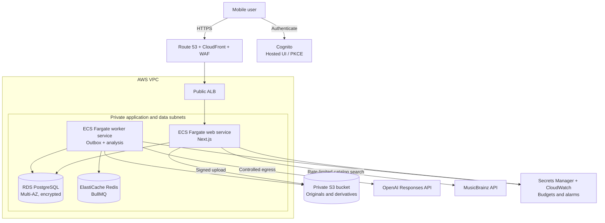

# Target production architecture

**Status: Proposed AWS reference architecture**

This target makes the current web/worker split production-ready without
changing the logical application into microservices. It is concrete enough for
cost, security, and failure-mode review, but it is not implemented and should
not be read as an accepted provider decision.

## Deployment view

The web service is the only public application origin. Database, Redis, and
worker tasks have no public addresses. S3 remains private; the browser receives
short-lived, object-scoped signed operations after authorization. Web and worker
egress to external providers travels through a controlled NAT path, while an S3
VPC endpoint can keep object traffic off the public internet.

## Identity and authorization

1. The browser uses authorization code with PKCE through a hosted identity UI.
2. The web application validates the issuer, audience, signature, expiry, and
   token use on every authenticated request.
3. An external subject maps to VinylHound's internal user ID; provider identity
   never replaces ownership checks in repository queries.
4. Authorization integration tests exercise cross-user scans, objects,
   batches, confirmations, and library items.
5. Account export and deletion span PostgreSQL rows, queue work, all three S3
   objects, logs subject to policy, and documented backup retention.

The identity provider is replaceable because persisted domain ownership is
already based on an internal user ID.

## Production responsibilities

| Area | Proposed control |
| --- | --- |
| Delivery | Build immutable web and worker images, scan them, publish to ECR, deploy through reviewed infrastructure and application workflows, and retain a known-good rollback image |
| Configuration | Keep non-secret configuration in task definitions and secrets in Secrets Manager; use separate roles for web and worker |
| Database | Automated backups, point-in-time recovery, encryption, restricted security groups, migration job, and a scheduled restore exercise |
| Redis | Encryption in transit/at rest, private access, bounded BullMQ retention, alarms for memory, failures, and queue age |
| Object storage | Block public access, encryption, version/lifecycle policy, upload limits, malware/content controls as justified, and deletion reconciliation |
| AI provider | Dedicated project/key, per-user and global concurrency, timeout/backoff, spend limits, usage alarms, and a circuit-breaker or kill switch |
| Catalog provider | Preserve the MusicBrainz one-request-per-second limiter, meaningful User-Agent, bounded cache, provenance, and user-triggered review flow; recheck terms before commercial use |
| Observability | Structured logs, request/scan/job correlation, latency and error metrics, queue age, outbox backlog, scan outcomes, token/cost totals, and alerts tied to user impact |
| Edge | TLS, WAF/rate limits, request-size boundaries, security headers, and origin access restricted to the edge path |

## Scaling model

- Scale web tasks on request concurrency or latency.
- Scale worker tasks on queue age and depth, bounded by global provider
  concurrency and spend limits.
- Scale outbox publishers safely using `SKIP LOCKED`; monitor lock time before
  replacing the current short transaction with a lease.
- Keep PostgreSQL authoritative and vertically size it first; add read replicas
  only when measured collection-query load requires them.
- Keep BullMQ/Redis while it meets delivery, recovery, and cost needs. Moving to
  SQS or another queue changes retry and job semantics and requires an ADR.
- Extract a service only when a package needs independent ownership,
  deployment cadence, security boundary, or scaling—not simply because cloud
  services are available.

## Availability and recovery targets to define

Before implementation, set explicit targets for:

- acceptable web and scan-processing availability;
- maximum queued-scan age;
- database recovery point and recovery time objectives;
- image and audit retention;
- monthly platform and provider budgets;
- maximum per-user batch size and scan rate.

The values should come from expected use and cost tolerance. The architecture
should not imply enterprise availability targets for a personal-project launch.

## Decisions still required

1. Confirm AWS and the chosen compute service with an ADR.
2. Choose production identity and internal-user mapping.
3. Define retention, export, deletion, and backup policies.
4. Establish infrastructure-as-code ownership and environment strategy.
5. Estimate steady-state and burst cost before provisioning managed Redis,
   Multi-AZ PostgreSQL, NAT, and always-on containers.
