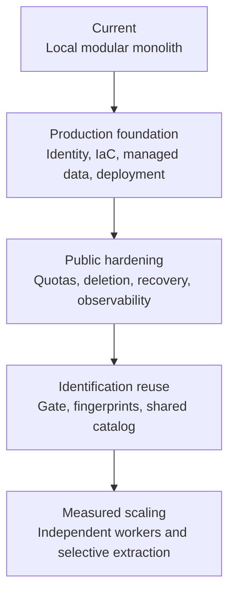
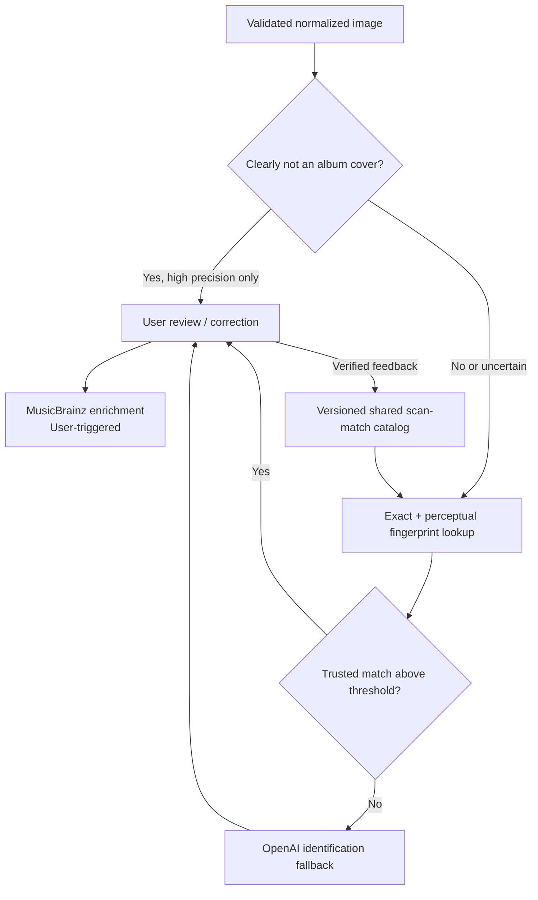

# Current-to-target evolution plan

**Status: Proposed, trigger-driven plan**

The goal is to improve production readiness and identification efficiency in
small, observable steps. Each phase should leave the application working and
should be adopted only when its entry evidence exists.

## Evolution map

The sequence is deliberate: a cross-user catalog should not be introduced
before production identity, privacy policy, deletion, and operational controls
exist.

## Phase plan

| Phase                    | Change                                                                                                                                                     | Entry trigger                                                                                    | Evidence to collect                                                                                                 | Explicitly avoid                                                      |
| ------------------------ | ---------------------------------------------------------------------------------------------------------------------------------------------------------- | ------------------------------------------------------------------------------------------------ | ------------------------------------------------------------------------------------------------------------------- | --------------------------------------------------------------------- |
| 0. Current MVP           | Keep the implemented web/worker modular monolith, MusicBrainz enrichment, and physical-copy model; finish library search/filter/export and copy management | Current state                                                                                    | Confirmation rate, correction rate, catalog-selection quality, latency, failure categories, cost per confirmed scan | Infrastructure expansion before users exercise the workflow           |
| 1. Production foundation | Add production identity, IaC, managed PostgreSQL/Redis/S3, container delivery, secrets, and basic telemetry                                                | A real hosted pilot is scheduled                                                                 | Deployment/rollback test, restore test, least-privilege review, baseline monthly cost                               | Microservice split or Kubernetes without a platform need              |
| 2. Public hardening      | Add quotas, rate limits, account export/deletion, retention, object cleanup, alerts, and incident runbooks                                                 | More than trusted personal users or public signup                                                | Cross-user authorization tests, abuse tests, deletion reconciliation, alert drills                                  | Treating signed URLs or model schemas as complete security controls   |
| 3. Identification reuse  | Add conservative non-album filtering, exact/perceptual fingerprints, shared scan-match lookup, and AI fallback                                             | Repeated scans and provider spend are large enough to measure reuse                              | False-reject rate, cache precision, reuse rate, correction/poisoning rate, avoided calls and cost                   | Rejecting ambiguous images or globally trusting one user's correction |
| 4. Measured scaling      | Scale workers, tune outbox/queue behavior, add read optimization, or extract a service selectively                                                         | Queue age, latency, data volume, deployment coupling, or team ownership exceeds a defined target | Load tests, traces, queue-age trends, database profile, cost comparison                                             | Replacing proven boundaries based on hypothetical scale               |

## Proposed post-release identification path

### Gate design

The first filter should reject only obvious non-album images at a threshold
chosen for very high precision. Ambiguous inputs continue to fingerprint and AI
analysis. The result and model/version should be auditable, and the user needs a
manual override. A lightweight local vision model or dedicated classification
endpoint should be evaluated against real uploads before adoption.

### Recognition reuse

Use a layered lookup rather than jumping directly to a vector database:

1. cryptographic hash for byte-identical derived images;
2. perceptual hash for resized, compressed, or slightly cropped copies;
3. optional image embedding search only if evaluation shows perceptual hashes
   miss useful matches;
4. AI identification when no trusted reusable match exists.

Catalog entries need provenance, version, confidence, and correction history.
A match should return canonical artist/title candidates to the existing review
flow, not bypass confirmation. Across users, store derived fingerprints and
canonical metadata; do not make another user's original image addressable.

## Adoption scorecard

Define targets before selecting an optimization. Suggested measures are:

- rank-1 and top-3 artist/title accuracy;
- user confirmation without edits and correction rate;
- non-album false-reject and false-accept rates;
- fingerprint/catalog precision and percentage of scans reused;
- p50/p95 time to a reviewable result;
- provider tokens and cost per confirmed scan;
- outbox backlog and queue age;
- upload, analysis, and confirmation failure rates;
- orphaned-object reconciliation and deletion completion;
- monthly infrastructure cost at idle and expected load.

## Required decision records

Add or update ADRs when the work selects:

- cloud provider, compute platform, and environment strategy;
- production identity and internal-user mapping;
- retention/deletion policy and object cleanup mechanism;
- external music catalog, after licensing and rate-limit research;
- non-album classifier and its rejection threshold;
- fingerprint or embedding technique and catalog-poisoning controls;
- a queue replacement or service extraction.

This preserves an honest portfolio narrative: the current design solves today's
workflow, and each additional component answers a measured production need.
